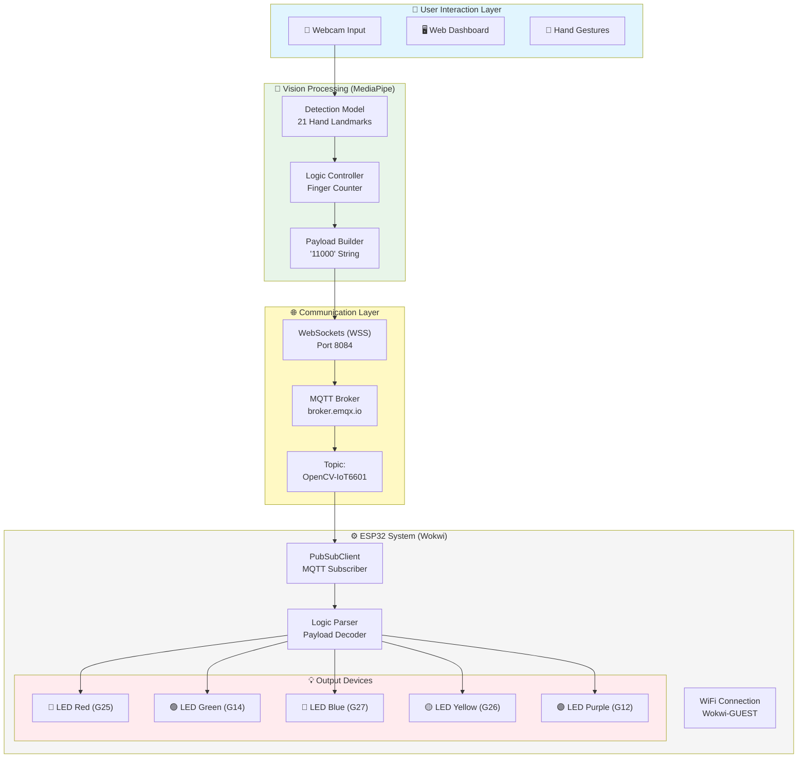
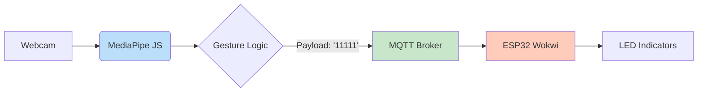
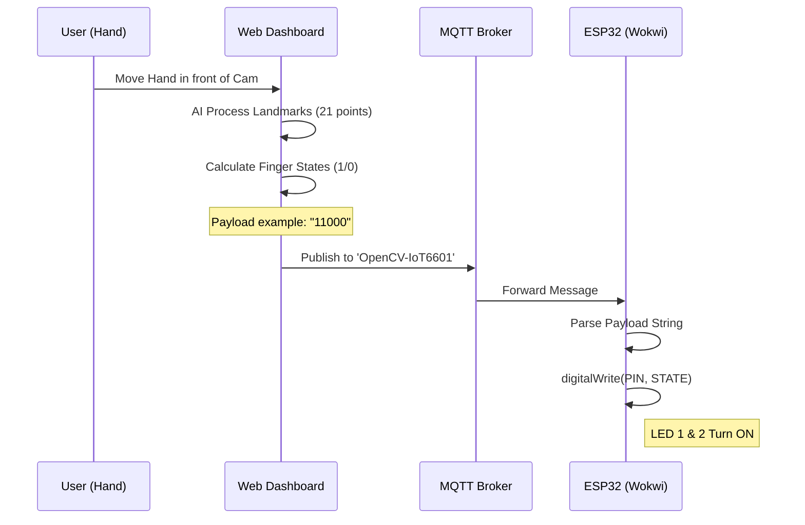

<div align="center">
    
# 🖐️ AI Hand-Tracking IoT Dashboard


**Real-Time Computer Vision & MQTT Control for ESP32 Ecosystem**

Sistem kontrol nirkabel menggunakan gesture tangan berbasis AI MediaPipe, diintegrasikan dengan ESP32 melalui MQTT broker.

</div>

---

## 📑 Daftar Isi

- [✨ Features](#-features)
- [🧩 Komponen Utama](#-komponen-utama)
- [🏗️ Arsitektur Sistem](#️-arsitektur-sistem)
- [🔄 Alur Kerja Sistem](#-alur-kerja-sistem)
- [📁 Struktur Project](#-struktur-project)
- [🚀 Quick Start](#-quick-start)
- [🔌 Pin Configuration](#-pin-configuration)
- [📊 Use Case & Logic](#-use-case--logic)
- [🔧 Troubleshooting](#-troubleshooting)

---

## System Overview



---

## ✨ Features

- 🦾 **Real-Time AI Tracking** - Menggunakan MediaPipe Hands untuk pelacakan 21 titik sendi tangan secara instan.
- 📡 **Wireless MQTT Control** - Komunikasi low-latency menggunakan broker EMQX ke perangkat IoT manapun.
- 🖥️ **Responsive Dashboard** - Antarmuka berbasis web yang modern dengan Tailwind CSS dan indikator status visual.
- 🎮 **Finger Gesture Mapping** - Setiap jari (Jempol s/d Kelingking) dipetakan secara unik ke pin digital ESP32.
- ☁️ **Cloud Simulation** - Terintegrasi penuh dengan Wokwi untuk pengujian tanpa perangkat fisik.
- 🔄 **Mirror Effect** - Visualisasi kamera yang intuitif seperti cermin untuk kenyamanan pengguna.

---

## 🧩 Komponen Utama

| Komponen        | Spesifikasi               | Fungsi                                         |
|------------------|---------------------------|------------------------------------------------|
| Frontend         | HTML5, Tailwind CSS, JS   | Antarmuka pengguna dan dashboard               |
| MediaPipe        | Hands Model v0.4          | AI Vision untuk ekstraksi landmark tangan      |
| MQTT.js          | Websocket Client          | Mengirim data gesture dari browser             |
| ESP32            | Simulator Wokwi           | Mikrokontroler penerima perintah               |
| PubSubClient     | Library Arduino           | Manajemen koneksi MQTT pada ESP32              |
| Broker           | broker.emqx.io            | Jembatan komunikasi antara Web & ESP32         |

---

## 🏗️ Arsitektur Sistem

### Diagram Blok Komunikasi



### Flowchart - Inisialisasi Sistem


---

## 🔄 Alur Kerja Sistem

### Sequence Diagram - Data Flow



---

## 📁 Struktur Project

```
hand-tracking-dashboard/
│
├── index.html            # 📄 Dashboard Utama (MediaPipe + MQTT Logic)
├── README.md             # 📖 Dokumentasi Proyek
└── assets/               # 📂 Aset pendukung (CSS/Images)
```

🔗 **GitHub Pages Dashboard**: [ficrammanifur.github.io/hand-tracking-dashboard](https://ficrammanifur.github.io/hand-tracking-dashboard/)  
🔗 **Wokwi Simulation**: [Simulasi ESP32](https://wokwi.com/projects/...)

---

## 🚀 Quick Start

1. **Jalankan Simulasi Perangkat**  
   - Buka Simulasi Wokwi.  
   - Klik tombol Start Simulation.  
   - Pastikan Serial Monitor menampilkan `connected` ke MQTT.

2. **Akses Dashboard Kontrol**  
   - Buka [Hand Tracking Dashboard](https://ficrammanifur.github.io/hand-tracking-dashboard/).  
   - Izinkan browser mengakses Kamera.  
   - Tunggu status indikator berubah menjadi **"TERHUBUNG KE BROKER"**.

3. **Monitoring**  
   - Lakukan gerakan tangan di depan kamera.  
   - Amati perubahan LED pada simulator Wokwi secara real-time.

---

## 🔌 Pin Configuration

**IoT Device Mapping (ESP32)**

| Jari       | Pin GPIO | Warna LED  | Index Payload | Deskripsi      |
|------------|----------|------------|---------------|----------------|
| Ibu Jari   | GPIO 25  | 🔴 Red     | msg[0]        | Thumb          |
| Telunjuk   | GPIO 14  | 🟢 Green   | msg[1]        | Index Finger   |
| Tengah     | GPIO 27  | 🔵 Blue    | msg[2]        | Middle Finger  |
| Manis      | GPIO 26  | 🟡 Yellow  | msg[3]        | Ring Finger    |
| Kelingking | GPIO 12  | 🟣 Purple  | msg[4]        | Pinky Finger   |

---

## 📊 Use Case & Logic

**Logika Deteksi Jari**

Logika utama menggunakan perbandingan koordinat sumbu Y pada landmark MediaPipe:

- **Titik Tip (Ujung)**: Landmark 8, 12, 16, 20.  
- **Titik PIP (Sendi)**: Landmark 6, 10, 14, 18.  
- **Aturan**: Jika \( Y_{tip} < Y_{PIP} \), maka status = **1** (Jari Terbuka).

**Contoh Skenario Payload**

- `"10000"` : Hanya LED Mera<div align="center">h (Ibu jari) menyala.  
- `"01100"` : LED Hijau dan Biru menyala (Gestur 'Peace'/'V').  
- `"11111"` : Semua LED menyala (Telapak tangan terbuka).  
- `"00000"` : Semua LED mati (Tangan mengepal).

---

## 🔧 Troubleshooting

| Masalah                | Penyebab                          | Solusi                                        |
|------------------------|------------------------------------|-----------------------------------------------|
| Kamera tidak muncul    | Izin browser ditolak              | Klik ikon gembok di URL bar, izinkan Kamera. |
| MQTT Disconnected      | Port Websocket terblokir          | Gunakan koneksi internet tanpa VPN/Firewall ketat. |
| LED Wokwi tidak respon | Broker delay / WiFi Wokwi          | Refresh simulator Wokwi dan pastikan Serial Monitor aktif. |
| Deteksi jari terbalik  | Posisi tangan terlalu jauh        | Pastikan tangan berada dalam jarak 0.5m - 1.5m dari kamera. |

---

<div align="center">

⭐ **Berikan Star jika proyek ini membantu Anda!**

⬆ [Kembali ke Atas](#-ai-hand-tracking-iot-dashboard)

</div>
