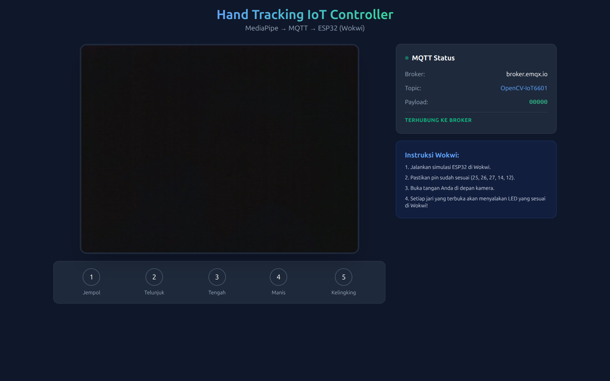
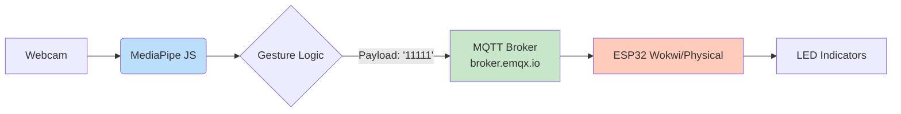
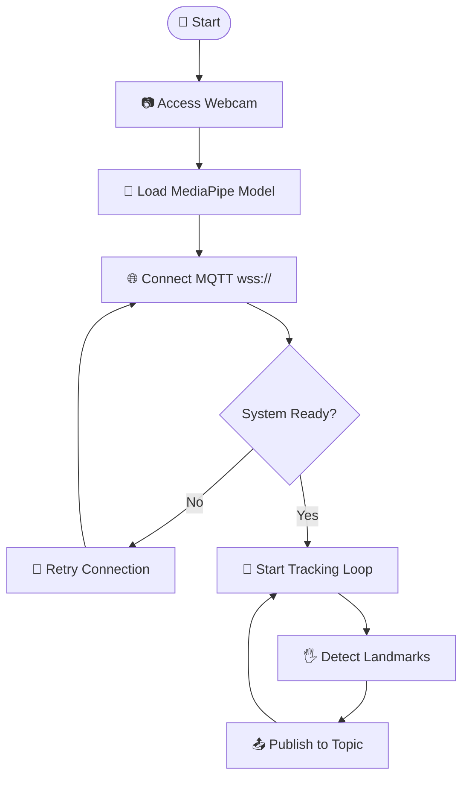
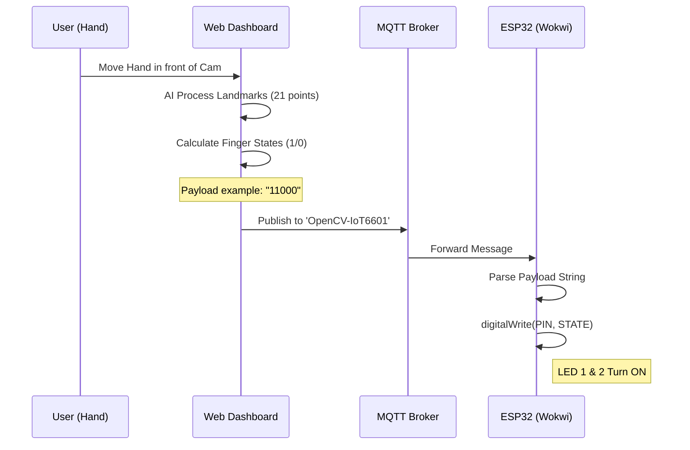

<div align="center">

# 🖐️ AI Hand-Tracking IoT Dashboard


**Real-Time Computer Vision & MQTT Control for ESP32 Ecosystem**

Sistem kontrol nirkabel menggunakan gesture tangan berbasis AI MediaPipe, diintegrasikan dengan ESP32 melalui MQTT broker. Seluruh proses AI berjalan di browser (edge computing) tanpa memerlukan backend server.

</div>

---

## 📸 Dashboard Preview


*Tampilan dashboard dengan deteksi tangan real-time dan status koneksi MQTT*


*Demo: Gestur tangan mengendalikan 5 LED pada simulator Wokwi*

---

## 📑 Daftar Isi

- [✨ Features](#-features)
- [🧠 Technologies Used](#-technologies-used)
- [🧩 Komponen Utama](#-komponen-utama)
- [🏗️ Arsitektur Sistem](#️-arsitektur-sistem)
- [🔄 Alur Kerja Sistem](#-alur-kerja-sistem)
- [📁 Struktur Project](#-struktur-project)
- [⚙️ Requirements](#️-requirements)
- [🚀 Quick Start](#-quick-start)
- [🔌 Pin Configuration](#-pin-configuration)
- [📊 Use Case & Logic](#-use-case--logic)
- [⚡ Performance](#-performance)
- [🌟 Key Advantages](#-key-advantages)
- [🔧 Troubleshooting](#-troubleshooting)
- [📄 License](#-license)

---

## ✨ Features

- 🦾 **Real-Time AI Tracking** - Menggunakan MediaPipe Hands untuk pelacakan 21 titik sendi tangan secara instan dengan kecepatan 25-30 FPS.
- 📡 **Wireless MQTT Control** - Komunikasi low-latency menggunakan broker EMQX ke perangkat IoT manapun.
- 🖥️ **Responsive Dashboard** - Antarmuka berbasis web yang modern dengan Tailwind CSS dan indikator status visual.
- 🎮 **Finger Gesture Mapping** - Setiap jari (Jempol s/d Kelingking) dipetakan secara unik ke pin digital ESP32.
- ☁️ **Cloud Simulation** - Terintegrasi penuh dengan Wokwi untuk pengujian tanpa perangkat fisik.
- 🔄 **Mirror Effect** - Visualisasi kamera seperti cermin untuk kenyamanan pengguna (implementasi CSS `transform: scaleX(-1)`).
- 🧠 **Edge AI Processing** - Semua proses computer vision berjalan di browser, tanpa server backend.

---

## 🧠 Technologies Used

| Teknologi | Fungsi |
|-----------|--------|
| **HTML5** | Struktur halaman web |
| **TailwindCSS** | Styling dan layout responsif |
| **MediaPipe Hands (JS)** | AI vision untuk deteksi landmark tangan |
| **MQTT.js** | Websocket client untuk komunikasi MQTT |
| **ESP32 + PubSubClient** | Mikrokontroler penerima perintah |
| **EMQX Broker** | Jembatan komunikasi antara web & ESP32 |
| **Wokwi Simulator** | Simulasi ESP32 tanpa hardware fisik |

---

## 🧩 Komponen Utama

| Komponen | Spesifikasi | Fungsi |
|----------|-------------|--------|
| Frontend | HTML5, Tailwind CSS, JS | Antarmuka pengguna dan dashboard |
| MediaPipe | @mediapipe/hands (JS API) | AI Vision untuk ekstraksi landmark tangan |
| MQTT.js | Websocket Client v4.3.7 | Mengirim data gesture dari browser |
| ESP32 | Simulator Wokwi / Fisik | Mikrokontroler penerima perintah |
| PubSubClient | Library Arduino v2.8 | Manajemen koneksi MQTT pada ESP32 |
| Broker | broker.emqx.io (WSS port 8084) | Jembatan komunikasi antara Web & ESP32 |

---

## 🏗️ Arsitektur Sistem

### Diagram Blok Komunikasi



### Flowchart - Inisialisasi Sistem



---

## 🔄 Alur Kerja Sistem

### Sequence Diagram - Data Flow



---

## 📁 Struktur Project

```
hand-tracking-dashboard/
│
├── index.html               # 📄 Dashboard Utama (semua kode inline)
├── README.md                # 📖 Dokumentasi Proyek
├── LICENSE                  # 📄 Lisensi MIT
└── assets/                  # 📂 Aset pendukung
    ├── dashboard-preview.png
    └── demo.gif
```

**Catatan**: Semua kode (HTML, CSS, JavaScript) berada dalam satu file `index.html` untuk kemudahan deployment di GitHub Pages.

---

## ⚙️ Requirements

- **Browser modern** dengan dukungan WebAssembly dan WebGL (Chrome 90+, Edge 90+, Firefox 88+)
- **Webcam** internal atau eksternal
- **Koneksi internet** untuk mengakses CDN MediaPipe dan MQTT broker
- **ESP32 device** fisik atau **Wokwi simulator** untuk testing

---

## 🚀 Quick Start

1. **Jalankan Simulasi Perangkat**  
   - Buka [Simulasi Wokwi ESP32](https://wokwi.com/projects/421496735837583361)  
   - Klik tombol Start Simulation  
   - Pastikan Serial Monitor menampilkan `Connected to MQTT broker`

2. **Akses Dashboard Kontrol**  
   - Buka [Hand Tracking Dashboard](https://ficrammanifur.github.io/hand-tracking-dashboard/)  
   - Izinkan browser mengakses Kamera  
   - Tunggu status indikator berubah menjadi **"TERHUBUNG KE BROKER"**

3. **Monitoring**  
   - Lakukan gerakan tangan di depan kamera  
   - Amati perubahan LED pada simulator Wokwi secara real-time

---

## 🔌 Pin Configuration

**IoT Device Mapping (ESP32)**

| Jari       | Pin GPIO | Warna LED  | Index Payload | Deskripsi      |
|------------|----------|------------|---------------|----------------|
| Ibu Jari   | GPIO 25  | 🔴 Red     | msg[0]        | Thumb          |
| Telunjuk   | GPIO 14  | 🟢 Green   | msg[1]        | Index Finger   |
| Tengah     | GPIO 27  | 🔵 Blue    | msg[2]        | Middle Finger  |
| Manis      | GPIO 26  | 🟡 Yellow  | msg[3]        | Ring Finger    |
| Kelingking | GPIO 12  | 🟣 Purple  | msg[4]        | Pinky Finger   |

---

## 📊 Use Case & Logic

**Logika Deteksi Jari**

Logika utama menggunakan perbandingan koordinat sumbu Y pada landmark MediaPipe:

- **Titik Ujung (Tip)**: Landmark 8, 12, 16, 20  
- **Titik Sendi (PIP)**: Landmark 6, 10, 14, 18  
- **Aturan**: Jika \( Y_{tip} < Y_{PIP} \), maka status = **1** (Jari Terbuka)

**Contoh Skenario Payload**

| Payload  | Gesture               | LED Menyala               |
|----------|----------------------|---------------------------|
| `"10000"`| Hanya Ibu Jari terbuka | 🔴 Red                    |
| `"01100"`| Gestur Peace/V       | 🟢 Green + 🔵 Blue        |
| `"11111"`| Telapak tangan terbuka | Semua LED                |
| `"00000"`| Tangan mengepal       | Tidak ada                 |
| `"10101"`| Pola jari ganjil      | 🔴 + 🔵 + 🟣              |

---

## ⚡ Performance

| Metrik | Nilai |
|--------|-------|
| **Average FPS** | 25–30 fps |
| **MQTT Latency** | ~50 ms (ke broker EMQX) |
| **Payload Size** | 5 bytes |
| **Model Load Time** | 2-3 detik (first load) |
| **CPU Usage** | 15-25% (pada browser modern) |

---

## 🌟 Key Advantages

- 🚫 **No Backend Required** - Semua proses berjalan di browser client
- 🧠 **Edge AI Processing** - Privasi terjaga karena video tidak dikirim ke server
- ⚡ **Low Latency** - Komunikasi MQTT Websocket untuk respon real-time
- 💻 **Cloud Simulation Ready** - Testing tanpa hardware fisik via Wokwi
- 🌐 **Deployable via GitHub Pages** - Gratis dan mudah diakses
- 🔧 **Zero Configuration** - Buka website, izinkan kamera, langsung bisa digunakan

---

## 🔧 Troubleshooting

| Masalah | Penyebab | Solusi |
|---------|----------|--------|
| Kamera tidak muncul | Izin browser ditolak | Klik ikon gembok di URL bar, izinkan Kamera |
| MQTT Disconnected | Port Websocket terblokir | Gunakan koneksi internet tanpa VPN/Firewall ketat |
| LED Wokwi tidak respon | Broker delay / WiFi Wokwi | Refresh simulator Wokwi dan pastikan Serial Monitor aktif |
| Deteksi jari terbalik | Posisi tangan terlalu jauh | Pastikan tangan berada dalam jarak 0.5m - 1.5m dari kamera |
| FPS rendah | Banyak tab terbuka / CPU load | Tutup tab yang tidak perlu, restart browser |
| Model tidak load | Koneksi internet lambat | Refresh halaman, pastikan koneksi stabil |

---

## 📄 License

Distributed under the MIT License. See `LICENSE` file for more information.

---

## 🙏 Acknowledgements

- [MediaPipe](https://mediapipe.dev/) - Tim Google untuk library vision yang luar biasa
- [EMQX Broker](https://www.emqx.com/) - MQTT broker publik yang gratis
- [Wokwi](https://wokwi.com/) - Simulator ESP32 terbaik
- [TailwindCSS](https://tailwindcss.com/) - CSS framework yang memudahkan styling

---

<div align="center">

⭐ **Berikan Star jika proyek ini membantu Anda!**  
🐛 **Laporkan issue** jika menemukan bug atau ada saran perbaikan

⬆ [Kembali ke Atas](#-ai-hand-tracking-iot-dashboard)

</div>
